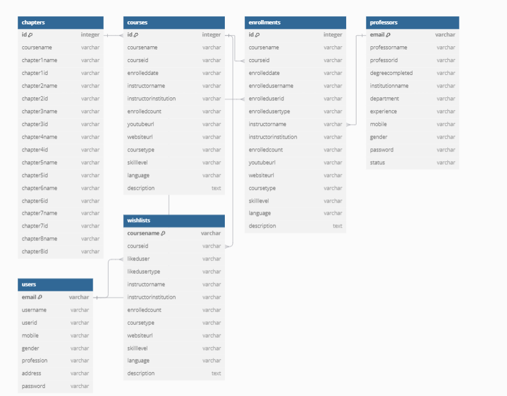

This is an ELearning Platform:

It has 3 services: User, Professor and Admin.

Anyone can be a User and enroll into new courses.

Similarly, Professors can create an account and add courses.

Admin can approve all the Professors and can either accept or reject enrolled professors.

Currently admin is the portal creators and no other can access it.

The above is our db connection.

The wireframe and all will be uploaded later.
